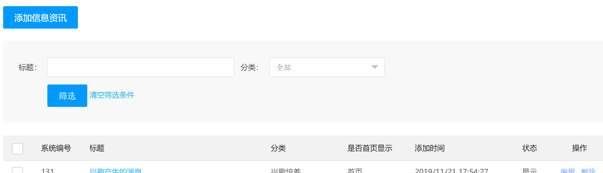
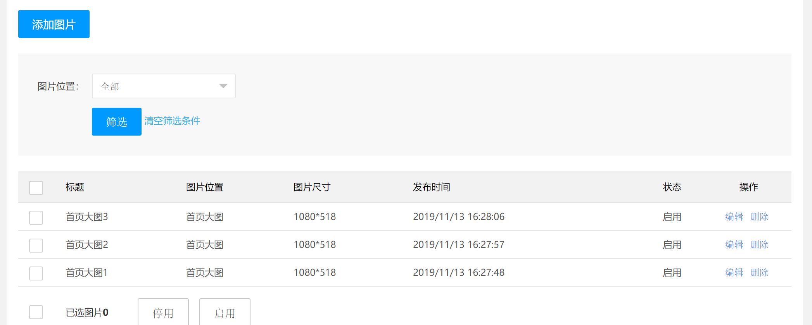
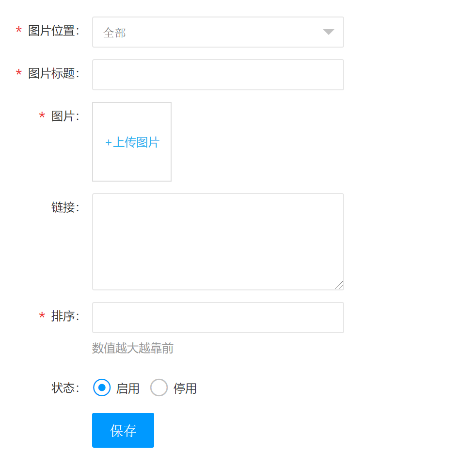
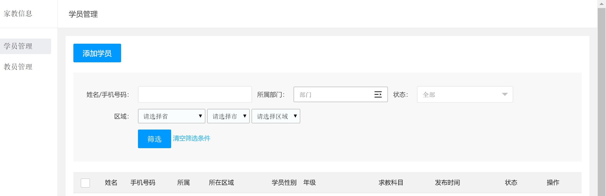

# 需求文档

# 用户侧

# 后台侧
## 登录快
- 登录
  - 账号
  - 密码
  - 图片验证码
- 添加管理员
  - 账号
  - 密码
- 退出
## 网站配置快

### 信息咨讯
- 用途: 配置当前较为热门的教育信息
  - 添加
  - 编辑
  - 删除

### 网站设置
- 用途：设置当前网站的联系方式。

### 图片管理
- 用途:设置首页图片

- 编辑图片

## 家教快

